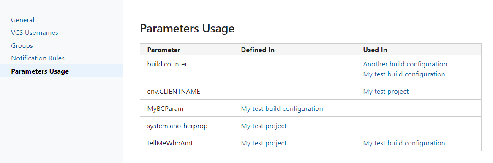

# Teamcity Build Parameters Usage Report

## Overview

This plugin adds a new page under <Your profile> -> My Settings and Tools - Parameters Usage.

The page contains a report of all your build parameters defined and/or used across projects or build configurations.



To build the report, the plugin scans your configuration files and looks for build parameters definitions as well as occurrencies of %...% pattern.
 
## Installation

Get the plugin zip file from the [Releases](/releases/latest) page and install it as per the Teamcity documentation

## Development

The plugins is built using [Teamcity SDK Maven plugin](https://github.com/JetBrains/teamcity-sdk-maven-plugin) and requires almost zero effort to start the development.

To get the local Teamcity installation and start the Teamcity server instance:

```bash
mvn tc-sdk:init
mvn tc-sdk:start
``` 

To build and deploy the plugin

```bash
mvn package tc-sdk:reload
```